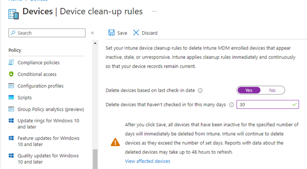

# Devices shall be deleted that haven’t checked in for over 30 days

## Description

By default, no devices are removed from Intune no matter the level of inactivity. In order to ensure an inventory of active authorized devices, device clean-up rules should be configured to automatically delete devices that have not checked in for over 30 days.

## Policy

* Devices are deleted from Intune if they have not checked in for over 30 days

## Licensing Considerations

Any tenant with Intune licensing can access this setting.

## Set-Up Instructions

[Overview of enrollment restrictions - Microsoft Intune | Microsoft Learn](https://learn.microsoft.com/en-us/mem/intune/enrollment/enrollment-restrictions-set)

[Create device platform restrictions - Microsoft Intune | Microsoft Learn](https://learn.microsoft.com/en-us/mem/intune/enrollment/create-device-platform-restrictions)

To set the device clean-up rule:

1. Go to the Intune Admin Center
2. Click on Devices
3. Scroll down to Other and select Device Clean-up rules
4. Select Yes for the first option
5. Set the time period to 30 days
6. Click Save

## End-User Impact


Level: <mark style="color:green;">Low</mark>


If users have a device that does no check in for over 30 days it would be removed from Intune. Devices can be recovered if someone were to take an extended leave for up to 180 days.


Tips

• If you are leveraging Intune as a source of truth for your asset inventory, you may want to change this setting to 60 or 90 days so that devices are not removed as quickly. This would give you more time to identify stale devices and take the proper action to reissue or retire the device.


## PowerShell Scripts

[https://neeraj.cloud/post/intune-device-cleanup-rules/#:\~:text=Intune%20Device%20clean-up%20rules%20and%20Azure%20AD%20%28Opt%29,device%20from%20Azure%20AD%20...%204%20References%20](https://neeraj.cloud/post/intune-device-cleanup-rules/)

## Videos&#x20;



